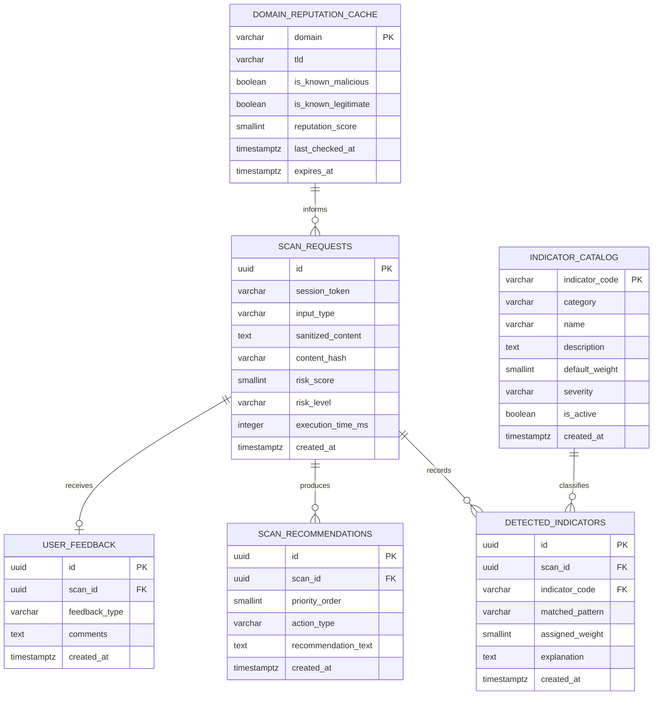

# Database Design: Sentinel Scam Validator (SSV)

**Document Version:** 1.0.0  
**Status:** Approved / Baseline  
**Date:** August 29, 2026  
**Module:** Data Architecture & Relational Schema Design  
**Parent Document:** [PROJECT_CHARTER.md](file:///C:/Users/yolanda/OneDrive/Desktop/Agile-Software-Development/Docs/PROJECT_CHARTER.md)  
**Related Document:** [REQUIREMENTS_SPECIFICATION.md](file:///C:/Users/yolanda/OneDrive/Desktop/Agile-Software-Development/Docs/REQUIREMENTS_SPECIFICATION.md)  

---

## 1. Architectural Overview & Design Decisions

### 1.1 Storage Technology Choice
* **Primary Relational Store:** **PostgreSQL 16+** (Production) / **SQLite 3** (Local Development).
  * *Rationale:* Structured relational model ensures referential integrity between scan events, triggered indicators, and recommendations. Strong support for JSONB, UUID generation (`uuid-ossp` or `pgcrypto`), and timestamp partitioning.
* **In-Memory Cache & Rate Limiting:** **Redis 7+**.
  * *Rationale:* Provides sub-millisecond lookups for common domain reputation scores and enforces token-bucket rate limiting per IP address.

### 1.2 Data Privacy by Design (PII Safeguards)
* **Sanitization Layer:** Before saving into the database, an ingestion interceptor parses text and strips personal telephone numbers, credit card numbers, email addresses, and OTP patterns, replacing them with generic tokens (e.g., `[REDACTED_PHONE]`, `[REDACTED_CARD]`).
* **Hash-Based Lookups:** A normalized SHA-256 hash of the sanitized content (`content_hash`) is indexed to allow rapid deduplication and cache hits without storing plaintext identifiers.

---

## 2. Entity-Relationship (ER) Diagram



---

## 3. Schema Definitions & Data Dictionaries

### 3.1 Table: `scan_requests`
Main log of all incoming scan events and calculated outcomes.

| Column | Data Type | Nullable | Default | Description |
| :--- | :--- | :--- | :--- | :--- |
| `id` | `UUID` | No | `gen_random_uuid()` | Primary Key (Public Scan Token). |
| `session_token` | `VARCHAR(64)` | No | - | Salted hash of client IP/browser session for rate limiting. |
| `input_type` | `VARCHAR(20)` | No | - | Type check: `'URL'`, `'TEXT'`, or `'HYBRID'`. |
| `sanitized_content` | `TEXT` | No | - | Payload with phone/card/PII redacted. Max 4,000 chars. |
| `content_hash` | `VARCHAR(64)` | No | - | SHA-256 hex digest of normalized content. |
| `risk_score` | `SMALLINT` | No | - | Aggregated score ($0 - 100$). |
| `risk_level` | `VARCHAR(15)` | No | - | Enum check: `'LOW'`, `'SUSPICIOUS'`, `'HIGH'`. |
| `execution_time_ms`| `INTEGER` | No | - | Processing duration in milliseconds. |
| `created_at` | `TIMESTAMPTZ`| No | `NOW()` | Timestamp when scan occurred. |

*Indexes:*
* `idx_scan_requests_content_hash` on `(content_hash)` — Fast cache hit retrieval.
* `idx_scan_requests_created_at` on `(created_at DESC)` — Chronological querying and batch archival.

---

### 3.2 Table: `indicator_catalog`
Master registry defining threat indicators, heuristic weights, and categories.

| Column | Data Type | Nullable | Default | Description |
| :--- | :--- | :--- | :--- | :--- |
| `indicator_code` | `VARCHAR(32)` | No | - | Primary Key. Unique code (e.g., `IND_URGENCY_24H`). |
| `category` | `VARCHAR(30)` | No | - | Grouping (`DOMAIN_ANOMALY`, `LINGUISTIC_PRESSURE`, `CREDENTIAL_HARVEST`). |
| `name` | `VARCHAR(100)`| No | - | Human-friendly title. |
| `description` | `TEXT` | No | - | Detailed description of the heuristic rule. |
| `default_weight` | `SMALLINT` | No | `20` | Base weight points added to risk score ($1 - 100$). |
| `severity` | `VARCHAR(10)` | No | `'MEDIUM'` | Check: `'INFO'`, `'MINOR'`, `'MAJOR'`, `'CRITICAL'`. |
| `is_active` | `BOOLEAN` | No | `TRUE` | Enable/disable toggle for dynamic tuning. |
| `created_at` | `TIMESTAMPTZ`| No | `NOW()` | Creation timestamp. |

---

### 3.3 Table: `detected_indicators`
Individual indicator occurrences detected for a specific scan request.

| Column | Data Type | Nullable | Default | Description |
| :--- | :--- | :--- | :--- | :--- |
| `id` | `UUID` | No | `gen_random_uuid()` | Primary Key. |
| `scan_id` | `UUID` | No | - | FK references `scan_requests(id)` ON DELETE CASCADE. |
| `indicator_code` | `VARCHAR(32)` | No | - | FK references `indicator_catalog(indicator_code)`. |
| `matched_pattern` | `VARCHAR(255)`| Yes | `NULL` | Matched snippet or keyword pattern (escaped). |
| `assigned_weight`| `SMALLINT` | No | - | Actual weight applied in this specific calculation. |
| `explanation` | `TEXT` | No | - | Plain-language reason displayed to the end user. |
| `created_at` | `TIMESTAMPTZ`| No | `NOW()` | Timestamp. |

*Indexes:*
* `idx_detected_indicators_scan_id` on `(scan_id)` — Rapid join for scan result view.

---

### 3.4 Table: `scan_recommendations`
Contextual next-step recommendations generated for the user.

| Column | Data Type | Nullable | Default | Description |
| :--- | :--- | :--- | :--- | :--- |
| `id` | `UUID` | No | `gen_random_uuid()` | Primary Key. |
| `scan_id` | `UUID` | No | - | FK references `scan_requests(id)` ON DELETE CASCADE. |
| `priority_order` | `SMALLINT` | No | `1` | Ordering index (1 = highest urgency). |
| `action_type` | `VARCHAR(30)` | No | - | Action tag (e.g., `DO_NOT_CLICK`, `DO_NOT_REPLY`, `VERIFY_OFFICIAL`). |
| `recommendation_text` | `TEXT` | No | - | User-facing advice string. |
| `created_at` | `TIMESTAMPTZ`| No | `NOW()` | Timestamp. |

*Indexes:*
* `idx_scan_recommendations_scan_id` on `(scan_id, priority_order ASC)` — Ordered retrieval.

---

### 3.5 Table: `domain_reputation_cache`
High-speed cache for evaluated domains to prevent repetitive network requests.

| Column | Data Type | Nullable | Default | Description |
| :--- | :--- | :--- | :--- | :--- |
| `domain` | `VARCHAR(255)`| No | - | Primary Key. Normalized lowercase FQDN (e.g., `login.xyz`). |
| `tld` | `VARCHAR(32)` | No | - | Extracted Top-Level Domain (e.g., `xyz`). |
| `is_known_malicious` | `BOOLEAN` | No | `FALSE` | Known phishing or malware host. |
| `is_known_legitimate`| `BOOLEAN` | No | `FALSE` | Verified brand or institutional domain. |
| `reputation_score` | `SMALLINT` | No | `50` | Normalized domain score ($0 = \text{malicious}, 100 = \text{trusted}$). |
| `last_checked_at` | `TIMESTAMPTZ`| No | `NOW()` | Timestamp of last threat intelligence refresh. |
| `expires_at` | `TIMESTAMPTZ`| No | - | Cache expiration threshold (TTL). |

*Indexes:*
* `idx_domain_cache_expires_at` on `(expires_at)` — Fast sweep for background cache eviction.

---

### 3.6 Table: `user_feedback`
User community ratings to validate scoring performance.

| Column | Data Type | Nullable | Default | Description |
| :--- | :--- | :--- | :--- | :--- |
| `id` | `UUID` | No | `gen_random_uuid()` | Primary Key. |
| `scan_id` | `UUID` | No | - | FK references `scan_requests(id)` ON DELETE CASCADE. |
| `feedback_type` | `VARCHAR(20)` | No | - | Check: `'ACCURATE'`, `'FALSE_POSITIVE'`, `'FALSE_NEGATIVE'`. |
| `comments` | `TEXT` | Yes | `NULL` | Optional end-user explanation. |
| `created_at` | `TIMESTAMPTZ`| No | `NOW()` | Timestamp. |

---

## 4. Complete SQL DDL (PostgreSQL Migration)

```sql
-- Enable UUID extension
CREATE EXTENSION IF NOT EXISTS "pgcrypto";

-- 1. Scan Requests Table
CREATE TABLE scan_requests (
    id UUID PRIMARY KEY DEFAULT gen_random_uuid(),
    session_token VARCHAR(64) NOT NULL,
    input_type VARCHAR(20) NOT NULL CHECK (input_type IN ('URL', 'TEXT', 'HYBRID')),
    sanitized_content TEXT NOT NULL,
    content_hash VARCHAR(64) NOT NULL,
    risk_score SMALLINT NOT NULL CHECK (risk_score >= 0 AND risk_score <= 100),
    risk_level VARCHAR(15) NOT NULL CHECK (risk_level IN ('LOW', 'SUSPICIOUS', 'HIGH')),
    execution_time_ms INTEGER NOT NULL,
    created_at TIMESTAMPTZ NOT NULL DEFAULT CURRENT_TIMESTAMP
);

CREATE INDEX idx_scan_requests_content_hash ON scan_requests(content_hash);
CREATE INDEX idx_scan_requests_created_at ON scan_requests(created_at DESC);

-- 2. Indicator Catalog Table
CREATE TABLE indicator_catalog (
    indicator_code VARCHAR(32) PRIMARY KEY,
    category VARCHAR(30) NOT NULL CHECK (category IN ('DOMAIN_ANOMALY', 'LINGUISTIC_PRESSURE', 'CREDENTIAL_HARVEST', 'PAYMENT_ANOMALY', 'BRAND_IMPERSONATION')),
    name VARCHAR(100) NOT NULL,
    description TEXT NOT NULL,
    default_weight SMALLINT NOT NULL CHECK (default_weight >= 1 AND default_weight <= 100),
    severity VARCHAR(10) NOT NULL CHECK (severity IN ('INFO', 'MINOR', 'MAJOR', 'CRITICAL')),
    is_active BOOLEAN NOT NULL DEFAULT TRUE,
    created_at TIMESTAMPTZ NOT NULL DEFAULT CURRENT_TIMESTAMP
);

-- Seed Baseline Rules
INSERT INTO indicator_catalog (indicator_code, category, name, description, default_weight, severity) VALUES
('IND_SUSP_TLD', 'DOMAIN_ANOMALY', 'High-Risk TLD', 'Destination domain utilizes a top-level domain frequently associated with abuse', 30, 'MAJOR'),
('IND_HOMOGLYPH', 'DOMAIN_ANOMALY', 'Homoglyph Character Spoofing', 'Domain uses internationalized lookalike characters to spoof authentic brand spelling', 40, 'CRITICAL'),
('IND_URGENCY_24H', 'LINGUISTIC_PRESSURE', 'Extreme Artificial Urgency', 'Message demands action within hours or threatens immediate negative consequences', 35, 'MAJOR'),
('IND_CRED_HARVEST', 'CREDENTIAL_HARVEST', 'Credential or OTP Request', 'Message solicits passwords, PINs, or one-time passcodes', 50, 'CRITICAL'),
('IND_PRIZE_REWARD', 'PAYMENT_ANOMALY', 'Unsolicited Prize or Gift Card', 'Message lures victim with unearned monetary gains or free products', 30, 'MAJOR');

-- 3. Detected Indicators Table
CREATE TABLE detected_indicators (
    id UUID PRIMARY KEY DEFAULT gen_random_uuid(),
    scan_id UUID NOT NULL REFERENCES scan_requests(id) ON DELETE CASCADE,
    indicator_code VARCHAR(32) NOT NULL REFERENCES indicator_catalog(indicator_code),
    matched_pattern VARCHAR(255),
    assigned_weight SMALLINT NOT NULL,
    explanation TEXT NOT NULL,
    created_at TIMESTAMPTZ NOT NULL DEFAULT CURRENT_TIMESTAMP
);

CREATE INDEX idx_detected_indicators_scan_id ON detected_indicators(scan_id);

-- 4. Scan Recommendations Table
CREATE TABLE scan_recommendations (
    id UUID PRIMARY KEY DEFAULT gen_random_uuid(),
    scan_id UUID NOT NULL REFERENCES scan_requests(id) ON DELETE CASCADE,
    priority_order SMALLINT NOT NULL DEFAULT 1,
    action_type VARCHAR(30) NOT NULL,
    recommendation_text TEXT NOT NULL,
    created_at TIMESTAMPTZ NOT NULL DEFAULT CURRENT_TIMESTAMP
);

CREATE INDEX idx_scan_recommendations_scan_id ON scan_recommendations(scan_id, priority_order ASC);

-- 5. Domain Reputation Cache Table
CREATE TABLE domain_reputation_cache (
    domain VARCHAR(255) PRIMARY KEY,
    tld VARCHAR(32) NOT NULL,
    is_known_malicious BOOLEAN NOT NULL DEFAULT FALSE,
    is_known_legitimate BOOLEAN NOT NULL DEFAULT FALSE,
    reputation_score SMALLINT NOT NULL DEFAULT 50 CHECK (reputation_score >= 0 AND reputation_score <= 100),
    last_checked_at TIMESTAMPTZ NOT NULL DEFAULT CURRENT_TIMESTAMP,
    expires_at TIMESTAMPTZ NOT NULL
);

CREATE INDEX idx_domain_cache_expires_at ON domain_reputation_cache(expires_at);

-- 6. User Feedback Table
CREATE TABLE user_feedback (
    id UUID PRIMARY KEY DEFAULT gen_random_uuid(),
    scan_id UUID NOT NULL REFERENCES scan_requests(id) ON DELETE CASCADE,
    feedback_type VARCHAR(20) NOT NULL CHECK (feedback_type IN ('ACCURATE', 'FALSE_POSITIVE', 'FALSE_NEGATIVE')),
    comments TEXT,
    created_at TIMESTAMPTZ NOT NULL DEFAULT CURRENT_TIMESTAMP
);
```

---

## 5. Maintenance & Lifecycle Management

* **Data Retention Policy:**
  * Raw scan records in `scan_requests`, `detected_indicators`, and `scan_recommendations` older than **90 days** are automatically archived or purged to respect data minimization principles.
* **Cache Invalidation:**
  * Background cron job runs hourly:
    ```sql
    DELETE FROM domain_reputation_cache WHERE expires_at < CURRENT_TIMESTAMP;
    ```
