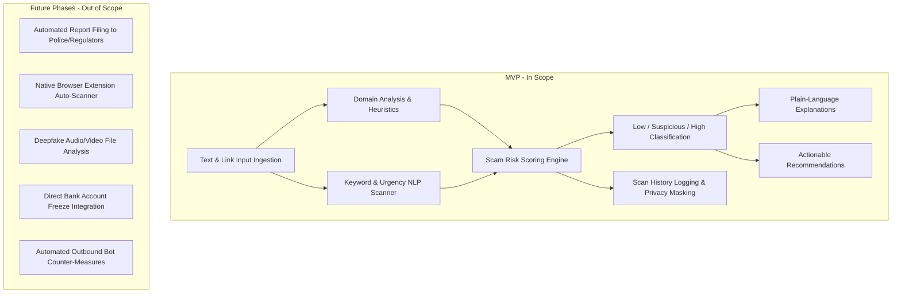
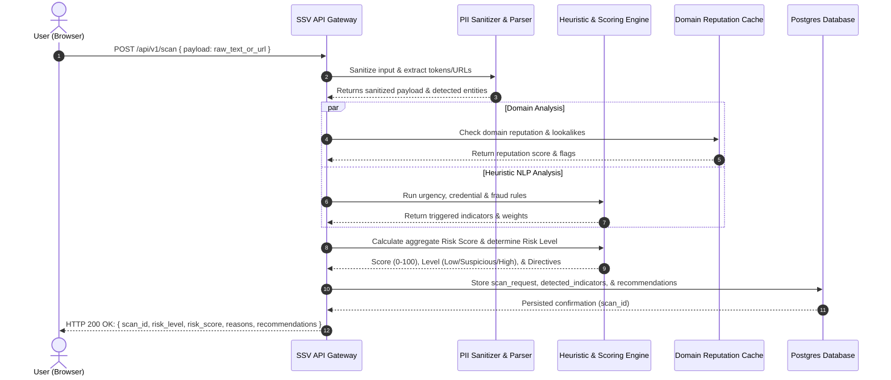
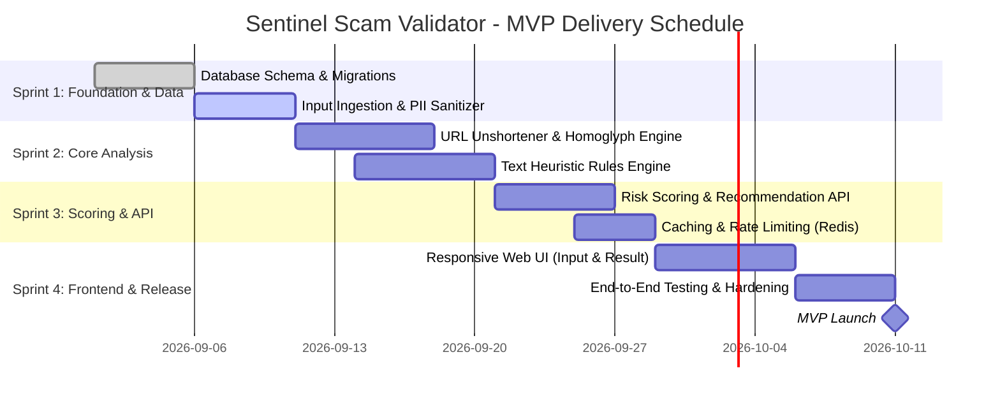

# Project Charter: Sentinel Scam Validator (SSV)

**Document Version:** 1.0.0  
**Status:** Approved / Baseline  
**Date:** August 29, 2026  
**Product:** Sentinel Scam Validator (SSV)  
**Target Delivery:** MVP (Minimum Viable Product)  

---

## 1. Executive Summary & Project Overview

### 1.1 Project Vision
**Sentinel Scam Validator (SSV)** is an accessible, intuitive web-based scam detection assistant designed to empower everyday digital citizens against modern social engineering threats, phishing scams, smishing attacks, and fraudulent web domains. By transforming complex cybersecurity heuristics into clear, actionable advice, SSV acts as a real-time defense companion for digital communication.

### 1.2 Problem Statement
Digital fraud, phishing messages (via SMS, WhatsApp, Telegram, email), and deceptive links continue to surge at unprecedented rates. Victims often suffer financial loss, credential theft, and identity fraud due to:
* **Sophisticated impersonation:** Scammers emulate legitimate institutions (banks, delivery services, government agencies).
* **Cognitive overload & panic:** Messages weaponize false urgency, fear, or false rewards, driving quick emotional decisions.
* **Technical barrier:** Existing technical tools (e.g., WHOIS lookups, DNS record inspection, raw regex sandboxes) are too complex for non-technical users to interpret safely and rapidly.

### 1.3 Proposed Solution
Sentinel Scam Validator bridges this technical gap with a zero-friction, lightweight web interface where users paste suspicious text or URLs to receive:
1. **Scam Checker:** Rapid automated inspection of message anatomy, deceptive domain patterns, and scam triggers.
2. **Scam Risk Score:** Transparent classification into **Low Risk**, **Suspicious**, or **High Risk** accompanied by plain-language justifications.
3. **Actionable Recommendations:** Immediate, practical next steps (e.g., *"Do not click,"* *"Do not reply,"* *"Verify with the official source"*).

---

## 2. Project Scope

### 2.1 In-Scope (MVP)
* **Single-input interface** accepting URLs, SMS messages, email excerpts, or chat snippets.
* **URL expansion & domain analysis** (detecting homoglyphs/typosquatting, suspicious top-level domains, IP-based URLs, brand mismatches).
* **Heuristic textual analysis** (urgency indicators, lottery/reward baits, threat/coercion markers, suspicious cryptocurrency or payment requests).
* **Tri-tier risk classification:**
  * **Low Risk:** No recognized threat indicators found.
  * **Suspicious:** Borderline or ambiguous indicators requiring caution.
  * **High Risk:** Clear malicious markers, recognized phishing patterns, or active blacklisted domains.
* **Clear reason breakdown:** Bulleted explanations demystifying why the score was assigned.
* **Prescriptive safety guidance:** Clear, imperative action points for immediate user safety.
* **Privacy safeguard:** Automatic client/server-side PII scrubbing (phone numbers, full names, authentication tokens) before persistence.

### 2.2 Out-of-Scope (Deferred to Future Iterations)
* End-to-end browser extensions or email client plugins.
* Deepfake audio, video, or scanned document OCR analysis.
* Automated reporting to law enforcement or domain registrars.
* User account registration and cross-device synced dashboards (MVP will operate with session/anonymous tokens).
* Financial institution payment blocking integrations.

---

## 3. Project Objectives & Key Performance Indicators (KPIs)

| Objective | Metric / KPI | MVP Target |
| :--- | :--- | :--- |
| **Rapid Assessment** | End-to-end response latency (from submit to rendered result) | $\le 1.5$ seconds (p95) |
| **High Accuracy** | True positive detection on benchmark phishing datasets | $\ge 92\%$ recall on confirmed scam corpuses |
| **Minimal False Alarms**| False positive rate on verified legitimate transactional messages | $\le 4\%$ on clean control corpuses |
| **Comprehensibility** | User comprehension score (post-scan clarity test) | $\ge 85\%$ users understand the recommended action |
| **High Availability** | Service uptime during operational window | $\ge 99.5\%$ |

---

## 4. MVP Core Feature Summary

* **1. Scam Checker:** Paste any suspicious link, message text, or hybrid notification to run heuristic token checks, URL expansions, homoglyph lookups, and keyword analysis.
* **2. Scam Risk Score:** Computes an aggregated score ($0 - 100$) mapped to **Low Risk**, **Suspicious**, or **High Risk** accompanied by plain-language bullet points explaining why.
* **3. Actionable Recommendations:** Delivers prioritized, clear imperative actions (e.g., *"Do not click links"*, *"Do not reply"*, *"Verify with the official source"*).

---

## 5. System Architecture & High-Level Flow

---

## 6. Project Documentation Directory

Detailed specifications, test acceptance suites, and data models have been separated into dedicated technical documents:

| Document | File Path | Focus Area |
| :--- | :--- | :--- |
| **Requirements Specification** | [REQUIREMENTS_SPECIFICATION.md](file:///C:/Users/yolanda/OneDrive/Desktop/Agile-Software-Development/Docs/REQUIREMENTS_SPECIFICATION.md) | Functional & Non-Functional specifications, MoSCoW priorities, persona descriptions, and RTM. |
| **Acceptance Criteria** | [ACCEPTANCE_CRITERIA.md](file:///C:/Users/yolanda/OneDrive/Desktop/Agile-Software-Development/Docs/ACCEPTANCE_CRITERIA.md) | User stories with Gherkin (Given-When-Then) BDD scenarios, boundary conditions, and Definition of Done. |
| **Database Design** | [DATABASE_DESIGN.md](file:///C:/Users/yolanda/OneDrive/Desktop/Agile-Software-Development/Docs/DATABASE_DESIGN.md) | ER diagrams, table definitions, data dictionary, indexing strategy, and SQL DDL migration scripts. |

---

## 7. Stakeholders & Governance (RACI Matrix)

| Role / Stakeholder | Project Charter | Requirements | Acceptance Criteria | Architecture & DB |
| :--- | :---: | :---: | :---: | :---: |
| **Product Owner** | Accountable | Accountable | Accountable | Consulted |
| **Lead Architect / Tech Lead** | Responsible | Responsible | Consulted | Accountable |
| **Security Engineer** | Consulted | Responsible | Consulted | Responsible |
| **QA / Test Engineer** | Informed | Consulted | Responsible | Consulted |
| **Full-Stack Developers** | Informed | Responsible | Responsible | Responsible |

---

## 8. Risk Management Matrix

| Risk Event | Likelihood | Impact | Severity | Mitigation Strategy |
| :--- | :--- | :--- | :--- | :--- |
| **High False Positive Rate on Valid Transactional Alerts** | Medium | High | High | Implement strict whitelist for verified official transactional sender patterns; weight single flags conservatively unless combined with external domain anomalies. |
| **Bypass via Obfuscated or Zero-Width Unicode Characters** | Medium | Medium | Medium | Implement robust input normalization, punycode decoders, and zero-width character stripping prior to pattern matching. |
| **Abuse via High-Volume Automated Scanning (DoS)** | High | Medium | High | Apply IP-rate limiting (Token Bucket via Redis) and enforce client proof-of-work/captcha for suspicious bursts. |
| **Leakage of Sensitive User Data (Credentials, PII)** | Low | Critical | High | Sanitize and scrub PII at the API boundary before persistence. Never log raw unmasked payloads in application log aggregators. |
| **Third-Party Reputation API Downtime** | Medium | Low | Medium | Utilize local reputation cache with TTL; degrade gracefully to internal heuristic scoring if external endpoints timeout. |

---

## 9. Agile Implementation Roadmap (MVP Sprints)

### Sprint Milestones:
* **Sprint 1 (Architecture & Ingestion):** Data layer initialization, database migration scripts, PII redaction pipeline, basic input validation.
* **Sprint 2 (Detection Engines):** Domain anomaly analyzer, URL expander, urgency/phishing regular expression dictionary and heuristic rules engine.
* **Sprint 3 (Scoring, Logic, & API):** Normalized risk calculation algorithm, actionable recommendation mapping, caching layer, and OpenAPI endpoints.
* **Sprint 4 (Interface & Quality Assurance):** Clean single-page UI, Low/Suspicious/High visual states, accessibility verification, and penetration testing.

---

## 10. Sign-Off & Approvals

| Stakeholder Role | Name | Title | Status | Date |
| :--- | :--- | :--- | :--- | :--- |
| **Product Owner** | Product Management Team | Lead Product Manager | Approved | 2026-08-29 |
| **Engineering Lead** | Tech Architecture Lead | Senior Full-Stack Architect | Approved | 2026-08-29 |
| **Security & Privacy** | SecOps Team Lead | Head of Information Security | Approved | 2026-08-29 |
