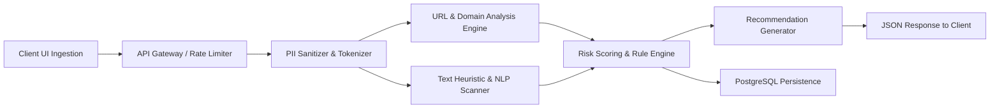

# Requirements Specification: Sentinel Scam Validator (SSV)

**Document Version:** 1.0.0  
**Status:** Approved / Baseline  
**Date:** August 29, 2026  
**Module:** Software Requirements Specification (SRS)  
**Parent Document:** [PROJECT_CHARTER.md](file:///C:/Users/yolanda/OneDrive/Desktop/Agile-Software-Development/Docs/PROJECT_CHARTER.md)  

---

## 1. Introduction

### 1.1 Purpose
This Software Requirements Specification (SRS) establishes the formal functional and non-functional criteria for the Minimum Viable Product (MVP) of **Sentinel Scam Validator (SSV)**. It serves as the baseline agreement between product owners, system architects, software developers, and QA engineers.

### 1.2 System Purpose & Product Scope
The Sentinel Scam Validator is a lightweight, high-performance security utility designed to validate suspicious text messages, emails, and URLs against phishing, smishing, and social engineering threat patterns. The system evaluates input payloads, computes a normalized risk rating, classifies results into **Low Risk**, **Suspicious**, or **High Risk**, and outputs unambiguous, actionable recommendations.

### 1.3 User Personas
* **Persona A (Everyday Citizen / Digital Consumer):** Receives an SMS claiming their package cannot be delivered without immediate payment. Needs a zero-friction, non-technical tool to answer: *"Is this safe to tap?"*
* **Persona B (Elderly / At-Risk User):** High susceptibility to fear-inducing messages (e.g., tax penalties, bank suspension). Needs reassuring, simple instructions on what to do (e.g., *"Do not reply"*).
* **Persona C (Workplace Employee):** Receives an urgent communication pretending to be their executive asking for gift cards or emergency transfers. Needs rapid verification before escalating to internal IT.

---

## 2. Overall Description & Constraints

### 2.1 Product Perspective
Sentinel Scam Validator operates as a client-server web application. The frontend exposes a minimal, uncluttered interface while the backend coordinates token sanitization, heuristic keyword scanners, domain reputation caches, and scoring algorithms.

### 2.2 Assumptions and Dependencies
* The system relies on valid URI parsing standards (RFC 3986).
* Third-party threat intelligence APIs (or local fallback caches) are reachable or fail gracefully without crashing the analysis.
* Users have active internet access to communicate with the web application.

---

## 3. Functional Requirements (FR)

Requirements are categorized using the MoSCoW prioritization model (**Must Have**, **Should Have**, **Could Have**, **Won't Have** for MVP).

### 3.1 Input Ingestion & Sanitization

| ID | Title | Description | Priority |
| :--- | :--- | :--- | :--- |
| **FR-01** | Multi-Format Ingestion | The system shall accept raw string inputs up to 4,000 characters via a single input area, including pure URLs, plaintext SMS/chat messages, or hybrid text containing embedded links. | **Must Have** |
| **FR-02** | Payload Identification | The system shall automatically parse the submission and classify it as `URL`, `TEXT`, or `HYBRID`. | **Must Have** |
| **FR-03** | PII Sanitization | The system shall detect and mask sensitive Personally Identifiable Information (such as 10–16 digit credit card numbers, phone numbers, email addresses, and one-time codes) before persisting records to the database. | **Must Have** |
| **FR-04** | Input Normalization | The system shall strip invisible control characters, normalize zero-width unicode characters, and decode standard HTML/URI percent encodings prior to rule evaluation. | **Must Have** |

### 3.2 URL & Domain Analysis Engine

| ID | Title | Description | Priority |
| :--- | :--- | :--- | :--- |
| **FR-05** | URL Extraction & Decomposition | The system shall extract protocol, subdomain, registered domain name, Top-Level Domain (TLD), port, path, and query parameters from all detected URLs. | **Must Have** |
| **FR-06** | Shortened Link Expansion | The system shall resolve and trace HTTP 301/302 redirects for known link shortening domains (e.g., `bit.ly`, `tinyurl.com`, `t.co`, `ow.ly`) up to 3 hops without executing active client scripts. | **Must Have** |
| **FR-07** | Homoglyph & Punycode Detection | The system shall detect non-ASCII IDN / Punycode domains and flag lookalike Latin homoglyph substitutions (e.g., Cyrillic 'а' replacing Latin 'a' in `pаypal.com`). | **Must Have** |
| **FR-08** | Risky Domain & TLD Heuristics | The system shall evaluate domain attributes against high-risk indicators: raw IPv4/IPv6 hosts, brand names present in subdomains rather than root domains, and uncommon or abuse-prone TLDs (`.top`, `.xyz`, `.work`). | **Must Have** |

### 3.3 Text Heuristic & Psychological Trigger Analysis

| ID | Title | Description | Priority |
| :--- | :--- | :--- | :--- |
| **FR-09** | Urgency & Coercion Scanning | The system shall detect vocabulary inducing artificial panic, imminent deadlines (*"within 24 hours"*, *"account locked"*, *"immediate legal action"*). | **Must Have** |
| **FR-10** | Credential Harvesting Triggers | The system shall detect calls to reveal sensitive authentication data (*"confirm password"*, *"enter OTP"*, *"verify your Social Security number"*). | **Must Have** |
| **FR-11** | Financial & Reward Traps | The system shall flag patterns related to prize winnings, lottery draws, unexpected refunds, gift cards, or requests for cryptocurrency payments. | **Must Have** |
| **FR-12** | Authority Impersonation | The system shall flag claims of representing banks, postal couriers (DHL, USPS, FedEx), or tax authorities when sent from non-matching, unverified domains or anonymous channels. | **Must Have** |

### 3.4 Scam Risk Scoring & Output Generation

| ID | Title | Description | Priority |
| :--- | :--- | :--- | :--- |
| **FR-13** | Weighted Score Calculation | The system shall aggregate weighted indicator scores onto a normalized scale from $0$ to $100$. | **Must Have** |
| **FR-14** | Tri-Tier Classification | The system shall assign a risk tier based on the final computed score:  • **Low Risk:** $0 - 29$ • **Suspicious:** $30 - 69$ • **High Risk:** $70 - 100$. | **Must Have** |
| **FR-15** | Justification Generation | The system shall return between 1 and 4 human-readable bullet points explaining the primary reasons contributing to the risk score. | **Must Have** |
| **FR-16** | Actionable Recommendations | The system shall generate context-specific, directive instructions based on the risk level (e.g., *"Do not click links"*, *"Do not reply"*, *"Verify with official source"*). | **Must Have** |
| **FR-17** | Unique Scan Permalinks | The system shall issue a UUIDv4 token for each scan to allow the user to review or share the result securely without exposing personal data. | **Should Have** |
| **FR-18** | User Accuracy Feedback | The system shall provide an interactive feedback widget allowing users to report whether the assessment was accurate, false positive, or false negative. | **Could Have** |

---

## 4. Non-Functional Requirements (NFR)

### 4.1 Performance & Latency
* **NFR-01 (Scan Latency):** For inputs requiring local heuristic evaluation, 95% of requests (p95) shall complete and return results within $\le 1,200\text{ ms}$.
* **NFR-02 (External Lookup Timeout):** If third-party reputation or domain DNS lookups exceed $1,500\text{ ms}$, the system shall abort the external query and fall back to local heuristic scoring without failing the request.

### 4.2 Security & Data Privacy
* **NFR-03 (Encrypted Transit):** All client-to-server and inter-service communications must be enforced over TLS 1.3.
* **NFR-04 (Input Sanitization / XSS Prevention):** All user input rendered in the web UI must be escaped and sanitized against Cross-Site Scripting (XSS).
* **NFR-05 (Zero Credential Retention):** The system shall never persist plaintext passwords, pins, OTPs, or credit card numbers extracted from scanned messages.
* **NFR-06 (Rate Limiting & Abuse Prevention):** The API Gateway shall enforce a rate limit of 30 requests per minute per IP/Session using an in-memory or Redis token bucket.

### 4.3 Reliability & Availability
* **NFR-07 (Uptime):** The system shall maintain an operational availability of $\ge 99.5\%$ excluding scheduled maintenance.
* **NFR-08 (Stateless Application Tier):** The API server layer must remain stateless to support seamless horizontal scaling and container restarts.

### 4.4 Usability & Accessibility
* **NFR-09 (Cognitive Accessibility):** Results and recommendations must not use cybersecurity jargon without simple definitions. Text readability shall target an 8th-grade reading level.
* **NFR-10 (WCAG Compliance):** The interface shall satisfy WCAG 2.1 Level AA criteria, including high contrast ratios, screen-reader semantic elements, and keyboard navigability.

---

## 5. Requirements Traceability Matrix (RTM)

| Req ID | Business Goal / Feature | Target Module | Acceptance Test ID |
| :--- | :--- | :--- | :--- |
| **FR-01 – FR-04** | Feature 1: Scam Checker | Input Sanitizer & Parser | AC-US1.1, AC-US4.1 |
| **FR-05 – FR-08** | Feature 1: Scam Checker | Domain Analyzer | AC-US1.1, AC-US1.2 |
| **FR-09 – FR-12** | Feature 1: Scam Checker | Text NLP Heuristics | AC-US2.1, AC-US3.1 |
| **FR-13 – FR-15** | Feature 2: Scam Risk Score | Risk Scoring Engine | AC-US1.1, AC-US2.1, AC-US3.1 |
| **FR-16** | Feature 3: Recommendations | Recommendation Service | AC-US1.1, AC-US2.1, AC-US3.1 |
| **FR-17 – FR-18** | Community & Feedback | Persistence & Audit Layer | AC-US5.1 |
| **NFR-01 – NFR-10**| Quality & Reliability | Infrastructure & Front-End | Non-Functional Benchmark Suite |
