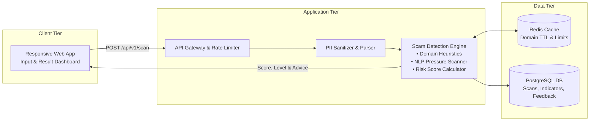
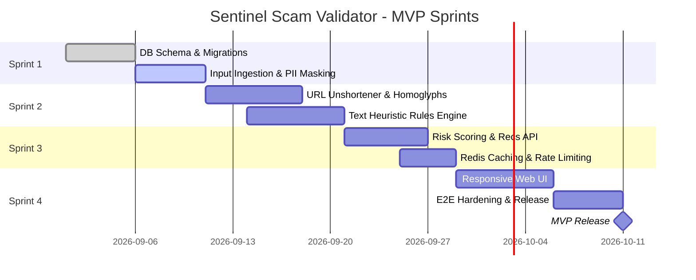

# 🛡️ Sentinel Scam Validator (SSV)

> **Real-time scam, phishing, and smishing validation assistant empowering digital citizens to identify deceptive communications before harm occurs.**

---

## 📖 Overview

**Sentinel Scam Validator (SSV)** is an agile, security-focused web application designed to evaluate suspicious URLs, text messages (SMS), and email snippets. Utilizing multi-tier heuristics, domain reputation verification, and natural language pattern analysis, SSV translates complex cyber threat indicators into clear, non-technical risk scores and prescriptive next steps.

---

## 🚀 MVP Core Features

| Feature | Description |
| :--- | :--- |
| **1. Scam Checker** | Paste a suspicious link or text message to analyze domain authenticity, link redirection hops, homoglyph character substitutions, and psychological pressure triggers. |
| **2. Scam Risk Score** | Receive an instant, normalized risk score ($0 - 100$) mapped into a clear three-tier classification: **Low Risk**, **Suspicious**, or **High Risk**, supported by plain-language justifications. |
| **3. Actionable Recommendations** | Get prioritized, clear directives on what to do next (e.g., *"Do not click links"*, *"Do not reply or share OTPs"*, or *"Verify independently with the official source"*). |

---

## 📂 Project Documentation Structure

All foundational architecture, specifications, and project management artifacts are located in the [`Docs/`](file:///C:/Users/yolanda/OneDrive/Desktop/Agile-Software-Development/Docs/) folder:

```
Agile-Software-Development/
├── README.md                                 <-- You are here (Project landing page)
└── Docs/
    ├── PROJECT_CHARTER.md                    <-- Vision, scope, KPIs, RACI, roadmap & risk matrix
    ├── REQUIREMENTS_SPECIFICATION.md         <-- Functional (FR) & Non-Functional (NFR) requirements, RTM
    ├── ACCEPTANCE_CRITERIA.md                <-- BDD User Stories (Given-When-Then), edge cases, Definition of Done
    └── DATABASE_DESIGN.md                    <-- ER diagram, schema definitions, indexes, DDL migrations
```

## 🏗️ High-Level System Architecture



---

## 🛠️ Technology Stack (Target MVP)

* **Frontend:** React / Next.js, Tailwind CSS (Accessible WCAG 2.1 AA UI).
* **Backend:** Node.js / TypeScript (Fastify/Express) or Python (FastAPI).
* **Database:** PostgreSQL 16+ (Structured persistence with UUID keys).
* **Cache & Rate Limiting:** Redis 7+ (Token-bucket throttling & domain reputation cache).
* **Testing:** Jest / Vitest for unit tests; Playwright / Cucumber for BDD acceptance scenarios.

---

## 📅 Agile Delivery Roadmap



---

## 🔒 Security & Privacy Notice

* **PII Redaction:** Phone numbers, credit cards, emails, and authentication tokens are masked prior to database persistence.
* **Non-Execution of Untrusted Links:** The system inspects headers, DNS, and redirects statically without executing untrusted JavaScript or downloading external binaries.
